# Phase 5 — Database Model

Implements the entities identified in Phase 1 (§1.7), named per Phase 2, structured per
Phase 3 (taxonomy) and Phase 4 (storage). Runnable SQL lives in `backend/migrations/`;
this document is the rationale and the ERD.

## 5.1 Design decisions

- **Plain SQL migrations, no ORM.** `pg` is the only DB dependency already in
  `backend/package.json`; no Sequelize/Prisma was introduced. Migrations are numbered,
  forward-only `.sql` files applied by `backend/src/db/migrate.js`, tracked in a
  `schema_migrations` table. This keeps the schema, including partial indexes, jsonb
  columns and generated tsvector columns, fully explicit — nothing an ORM would hide.
- **UUID primary keys** (`gen_random_uuid()`, `pgcrypto`) everywhere. A multi-device,
  potentially multi-agent system benefits from globally unique, non-guessable,
  non-sequential IDs (no path-enumeration risk on file/document endpoints).
- **No binary content in Postgres.** Confirmed by every file/content table below —
  `file_content.extracted_text` is the only large text stored, and only because it's the
  substrate for search, not the source of truth for the document itself.
- **History is additive, not destructive.** Nothing in this schema has a hard `DELETE`
  as its normal lifecycle; soft-delete/status columns and `audit_logs` are the standard.
- **Every automated result carries `confidence_level` + `confidence_score` + `method`.**
  Applied consistently on `document_versions`, `document_subjects`,
  `classification_results`, `rename_proposals`, `duplicate_groups` — this is Phase 1
  §1.5 made structural, not optional.

## 5.2 Entity groups and migration files

| # | File | Contents |
|---|---|---|
| 001 | `001_extensions.sql` | `pgcrypto` (uuid gen), `pg_trgm` (fuzzy filename matching), enum types |
| 002 | `002_users_roles_permissions.sql` | `users`, `roles`, `permissions`, `role_permissions`, `user_roles`, `refresh_tokens` |
| 003 | `003_storage.sql` | `storage_locations`, `filesystem_agents` |
| 004 | `004_files.sql` | `files`, `file_hashes`, `file_metadata`, `file_content` |
| 005 | `005_taxonomy.sql` | `subjects` (self-referential), `document_types`, `tags` |
| 006 | `006_documents.sql` | `documents`, `document_versions`, `document_subjects`, `document_tags`, `related_documents` |
| 007 | `007_duplicates.sql` | `duplicate_groups`, `duplicate_group_members` |
| 008 | `008_processing.sql` | `processing_jobs`, `processing_job_items`, `filesystem_scans` |
| 009 | `009_naming_classification.sql` | `rename_proposals`, `classification_results` |
| 010 | `010_audit.sql` | `audit_logs` |
| 011 | `011_indexes_search.sql` | Cross-cutting indexes, full-text search trigger |

Seeds (reference data, not schema) live separately in `backend/seeds/`:
`001_roles_permissions.sql`, `002_subjects_document_types.sql`.

## 5.3 ERD

```mermaid
erDiagram
    USERS ||--o{ USER_ROLES : has
    ROLES ||--o{ USER_ROLES : assigned_to
    ROLES ||--o{ ROLE_PERMISSIONS : grants
    PERMISSIONS ||--o{ ROLE_PERMISSIONS : granted_via
    USERS ||--o{ REFRESH_TOKENS : owns

    STORAGE_LOCATIONS ||--o{ FILESYSTEM_AGENTS : brokered_by
    STORAGE_LOCATIONS ||--o{ FILES : hosts

    FILES ||--o{ FILE_HASHES : has
    FILES ||--o| FILE_METADATA : has
    FILES ||--o| FILE_CONTENT : has
    FILES ||--o| DOCUMENT_VERSIONS : backs

    SUBJECTS ||--o{ SUBJECTS : parent_of
    DOCUMENT_TYPES ||--o{ DOCUMENTS : types

    DOCUMENTS ||--o{ DOCUMENT_VERSIONS : has
    DOCUMENTS ||--o{ DOCUMENT_SUBJECTS : placed_in
    SUBJECTS ||--o{ DOCUMENT_SUBJECTS : contains
    DOCUMENTS ||--o{ DOCUMENT_TAGS : tagged
    TAGS ||--o{ DOCUMENT_TAGS : applied_to
    DOCUMENTS ||--o{ RELATED_DOCUMENTS : relates

    DUPLICATE_GROUPS ||--o{ DUPLICATE_GROUP_MEMBERS : contains
    FILES ||--o{ DUPLICATE_GROUP_MEMBERS : member_of

    PROCESSING_JOBS ||--o{ PROCESSING_JOB_ITEMS : tracks
    FILES ||--o{ PROCESSING_JOB_ITEMS : processed_in

    FILES ||--o{ RENAME_PROPOSALS : proposed_for
    FILES ||--o{ CLASSIFICATION_RESULTS : classified

    USERS ||--o{ AUDIT_LOGS : performs
```



## 5.4 Notable relationships explained

- **`files.storage_location_id` + `current_path`** carry a `UNIQUE` constraint together
  — the database itself enforces that no two active File rows claim the same path on the
  same location.
- **`document_versions.file_id`** is `UNIQUE` (nullable) — one File backs at most one
  Version. Multiple *identical* files that represent the same version are handled via
  `duplicate_groups`, not by attaching many files to one version — keeping "this Version
  has replicas" and "this Version's canonical byte content" cleanly separate.
- **`document_subjects`** is the many-to-many join carrying `relevance`
  (`primary`/`secondary`) and confidence — a partial unique index guarantees at most one
  `primary` row per document.
- **`duplicate_groups.canonical_file_id`** is nullable until a human (or a
  policy-permitted high-confidence rule) selects a canonical file; members are never
  deleted from the group automatically.
- **`related_documents`** is a self-join on `documents` (not `files`) because
  "related" is a meaning-level relationship, per Phase 1 §1.3.

## 5.5 Indexing strategy

- B-tree on every foreign key used in joins (`files.storage_location_id`,
  `document_versions.document_id`, etc.) — Postgres does not auto-index FKs.
- `pg_trgm` GIN index on `files.filename_original` and `documents.canonical_name` for
  fast fuzzy/"contains" filename search without a full scan.
- `GIN` index on `file_content.search_vector` (generated `tsvector` column) for
  extracted-text full-text search.
- `GIN` index on jsonb metadata columns (`file_metadata.metadata`,
  `processing_jobs.payload`) for targeted key lookups.
- Partial index on `files.status` for the common "active files only" query path, and on
  `processing_jobs.status` for the queue-monitoring dashboard.

## 5.6 Running it

```bash
cd backend
cp .env.example .env      # set DATABASE_URL
npm install
npm run db:migrate        # applies backend/migrations/*.sql in order
npm run db:seed           # loads backend/seeds/*.sql (idempotent)
```
